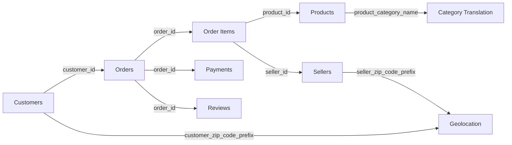

<div align="center">

# 🛒 E-Commerce Public Data Analysis

**Analisis data end-to-end atas Brazilian E-Commerce Public Dataset by Olist menggunakan Python, Jupyter Notebook, dan Streamlit.**

[](https://www.python.org/)
[](https://streamlit.io/)
[](https://pandas.pydata.org/)
[](https://jupyter.org/)
[](#status-proyek)

[🚀 Buka Live Dashboard](https://dataanalystproject-e-commercepublicdataset-qnnq59ujt6mwtv83atk.streamlit.app)
&nbsp;•&nbsp;
[📓 Buka Notebook](./notebook.ipynb)
&nbsp;•&nbsp;
[💻 Lihat Source Dashboard](./dashboard/dashboard.py)

</div>

> [!IMPORTANT]
> README ini mendokumentasikan branch **`legacy/dicoding-submission`**, yaitu versi original yang digunakan sebagai submission kelas **Belajar Fundamental Analisis Data** dari Dicoding. Branch ini dipertahankan sebagai arsip historis dan tidak selalu merepresentasikan versi terbaru proyek pada branch lain.

---

## Daftar Isi

- [Tentang Proyek](#tentang-proyek)
- [Tujuan dan Cakupan Analisis](#tujuan-dan-cakupan-analisis)
- [Ringkasan Dataset](#ringkasan-dataset)
- [Relasi Antardataset](#relasi-antardataset)
- [Alur Analisis](#alur-analisis)
- [Insight Utama](#insight-utama)
- [Fitur Dashboard](#fitur-dashboard)
- [Teknologi yang Digunakan](#teknologi-yang-digunakan)
- [Struktur Repository](#struktur-repository)
- [Menjalankan Proyek](#menjalankan-proyek)
- [Menjalankan Notebook](#menjalankan-notebook)
- [GitHub Codespaces](#github-codespaces)
- [Catatan Reproduksibilitas](#catatan-reproduksibilitas)
- [Status Proyek](#status-proyek)
- [Acknowledgements](#acknowledgements)

---

## Tentang Proyek

Proyek ini merupakan implementasi analisis data e-commerce secara end-to-end, mulai dari pemuatan dan pemeriksaan data mentah, pembersihan data, eksplorasi, visualisasi, analisis geospasial, hingga segmentasi pelanggan menggunakan pendekatan **RFM Analysis**.

Hasil analisis disajikan melalui dua komponen utama:

1. **Jupyter Notebook**  
   Berisi proses analisis data, data wrangling, exploratory data analysis, visualisasi, serta penarikan insight.

2. **Streamlit Dashboard**  
   Menyediakan visualisasi interaktif dengan filter rentang tanggal untuk membantu pengguna mengeksplorasi performa penjualan, kategori produk, ulasan pelanggan, persebaran geografis, dan perilaku pelanggan.

Dataset yang digunakan adalah **Brazilian E-Commerce Public Dataset by Olist**, sebuah dataset transaksi e-commerce Brasil yang mencakup pesanan, pelanggan, produk, penjual, pembayaran, ulasan, dan data geolokasi.

---

## Tujuan dan Cakupan Analisis

Analisis dalam proyek ini berfokus pada lima area utama.

### 1. Performa penjualan dari waktu ke waktu

- Menghitung jumlah pesanan unik.
- Menghitung total nilai pembayaran sebagai revenue.
- Mengamati perubahan jumlah pesanan berdasarkan tanggal pembelian.
- Menyediakan filter periode untuk analisis yang lebih fleksibel.

### 2. Performa kategori produk

- Mengidentifikasi kategori produk dengan jumlah penjualan tertinggi.
- Mengidentifikasi kategori produk dengan jumlah penjualan terendah.
- Menggunakan nama kategori produk dalam bahasa Inggris agar lebih mudah dibaca.

### 3. Kepuasan pelanggan

- Menganalisis distribusi skor ulasan dari 1 hingga 5.
- Mengidentifikasi dominasi ulasan positif maupun negatif.
- Menggunakan jumlah ulasan sebagai indikator awal pengalaman pelanggan.

### 4. Persebaran geografis pelanggan

- Menghubungkan data pelanggan dengan koordinat berdasarkan kode pos.
- Membersihkan duplikasi data geolokasi.
- Membatasi koordinat ke wilayah geografis Brasil.
- Menampilkan konsentrasi pelanggan menggunakan **Folium HeatMap**.

### 5. RFM Analysis

RFM digunakan untuk memahami nilai dan aktivitas pelanggan berdasarkan:

- **Recency** — jumlah hari sejak transaksi terakhir pelanggan.
- **Frequency** — jumlah pesanan unik yang dilakukan pelanggan.
- **Monetary** — total nilai pembayaran pelanggan.

Dashboard menampilkan nilai rata-rata RFM serta pelanggan teratas berdasarkan masing-masing dimensi.

---

## Ringkasan Dataset

Data mentah terdiri dari sembilan file CSV yang saling berhubungan.

| Dataset | Jumlah Baris | Fungsi Utama |
|---|---:|---|
| `customers_dataset.csv` | 99.441 | Identitas pelanggan, kode pos, kota, dan state |
| `orders_dataset.csv` | 99.441 | Status pesanan dan tahapan waktu pemrosesan pesanan |
| `order_items_dataset.csv` | 112.650 | Produk, penjual, harga, freight, dan item dalam pesanan |
| `order_payments_dataset.csv` | 103.886 | Metode pembayaran, cicilan, dan nilai pembayaran |
| `order_reviews_dataset.csv` | 99.224 | Skor dan komentar ulasan pelanggan |
| `products_dataset.csv` | 32.951 | Kategori dan atribut fisik produk |
| `product_category_name_translation.csv` | 71 | Terjemahan nama kategori produk ke bahasa Inggris |
| `sellers_dataset.csv` | 3.095 | Identitas serta lokasi penjual |
| `geolocation_dataset.csv` | 1.000.163 | Koordinat geografis berdasarkan kode pos Brasil |

### Cakupan data

| Metrik | Nilai |
|---|---:|
| Periode transaksi | 4 September 2016 – 17 Oktober 2018 |
| Total pesanan | 99.441 |
| Pelanggan unik | 96.096 |
| Produk unik | 32.951 |
| Penjual unik | 3.095 |
| State pelanggan | 27 |
| State penjual | 23 |

### Pertimbangan kualitas data mentah

Beberapa karakteristik data yang perlu diperhatikan selama proses analisis:

- `geolocation_dataset.csv` mengandung banyak koordinat berulang untuk kode pos yang sama.
- Dataset produk memiliki missing value pada kategori serta beberapa atribut fisik.
- Dataset ulasan memiliki missing value dalam jumlah besar pada kolom komentar karena tidak semua pelanggan menulis komentar.
- Dataset pesanan memiliki missing value pada timestamp tertentu, terutama untuk pesanan yang belum selesai atau dibatalkan.
- Beberapa kolom tanggal pada file CSV perlu dikonversi dari tipe `object` menjadi `datetime`.

---

## Relasi Antardataset



Relasi tersebut memungkinkan analisis transaksi dari berbagai dimensi, mulai dari pelanggan, produk, penjual, pembayaran, ulasan, hingga lokasi geografis.

---

## Alur Analisis

### 1. Data Gathering

Seluruh dataset dimuat menggunakan `pandas.read_csv()` dan diperiksa struktur awalnya.

### 2. Data Assessing

Tahap pemeriksaan mencakup:

- nama dan tipe kolom;
- jumlah baris dan kolom;
- missing value;
- data duplikat;
- rentang nilai;
- konsistensi primary key dan foreign key;
- validitas timestamp dan koordinat geografis.

### 3. Data Cleaning

Tahap pembersihan meliputi:

- konversi kolom waktu menjadi `datetime`;
- penghapusan duplikasi geolokasi berdasarkan kode pos;
- penggabungan nama kategori dengan tabel terjemahan;
- penggabungan tabel transaksi berdasarkan key yang relevan;
- pengurutan data berdasarkan waktu pembelian;
- pembatasan koordinat agar berada dalam bounding box Brasil.

### 4. Exploratory Data Analysis

EDA digunakan untuk memahami:

- distribusi status pesanan;
- tren transaksi;
- performa kategori produk;
- distribusi skor ulasan;
- persebaran pelanggan;
- perilaku transaksi pelanggan.

### 5. Explanatory Analysis

Insight utama disajikan melalui grafik time series, bar chart, peta panas interaktif, KPI, dan visualisasi RFM.

### 6. Dashboard Development

Hasil analisis dikemas dalam aplikasi Streamlit agar dapat dieksplorasi secara interaktif berdasarkan rentang tanggal yang dipilih pengguna.

---

## Insight Utama

Berdasarkan pemeriksaan terhadap dataset mentah:

- **96.478 dari 99.441 pesanan berstatus `delivered`**, setara dengan sekitar **97,02%** dari seluruh pesanan.
- Dataset mencatat **96.096 pelanggan unik**, yang menunjukkan bahwa sebagian pelanggan melakukan lebih dari satu transaksi.
- Kategori **`bed_bath_table`** merupakan kategori dengan jumlah item penjualan tertinggi, yaitu **11.115 item**.
- Rata-rata skor ulasan pelanggan adalah sekitar **4,09 dari 5**.
- Ulasan bintang 5 mencakup sekitar **57,78%** dari seluruh ulasan.
- Pembayaran dengan **credit card** menyumbang sekitar **78,34%** dari total nilai pembayaran.
- State **São Paulo (`SP`)** mencakup sekitar **41,98%** dari seluruh pelanggan berdasarkan data pesanan pelanggan.

> Insight di atas bersifat deskriptif dan mengikuti cakupan data historis pada dataset. Interpretasi bisnis lanjutan perlu mempertimbangkan periode, status pesanan, struktur penggabungan data, dan definisi metrik yang digunakan.

---

## Fitur Dashboard

Dashboard Streamlit menyediakan fitur berikut:

### Filter interaktif

- Pemilihan rentang tanggal transaksi.
- Seluruh visualisasi dan KPI diperbarui berdasarkan periode terpilih.

### KPI penjualan

- Total orders.
- Total revenue dalam **Brazilian Real (BRL)**.

### Tren pesanan

- Grafik jumlah pesanan harian.
- Visualisasi time series untuk mengamati pola transaksi dari waktu ke waktu.

### Analisis kategori produk

- Lima kategori dengan penjualan tertinggi.
- Lima kategori dengan penjualan terendah.

### Analisis ulasan

- Distribusi review score dari 1 hingga 5.
- Label jumlah ulasan pada setiap skor.

### Analisis geospasial

- Peta interaktif Brasil.
- Heatmap konsentrasi lokasi pelanggan.
- Integrasi antara Streamlit, Folium, dan `streamlit-folium`.

### Analisis RFM

- Average Recency.
- Average Frequency.
- Average Monetary.
- Lima pelanggan teratas berdasarkan Recency, Frequency, dan Monetary.

---

## Teknologi yang Digunakan

| Teknologi | Versi | Kegunaan |
|---|---:|---|
| Python | 3.11 | Bahasa pemrograman utama |
| Pandas | 2.1.4 | Manipulasi dan analisis data |
| Matplotlib | 3.8.2 | Visualisasi data |
| Seaborn | 0.13.0 | Visualisasi statistik |
| Streamlit | 1.32.0 | Dashboard interaktif |
| Folium | 0.15.1 | Peta interaktif |
| Streamlit Folium | 0.15.1 | Integrasi Folium dengan Streamlit |
| Babel | 2.14.0 | Format nilai mata uang BRL |
| Jupyter Notebook | — | Dokumentasi dan proses analisis eksploratif |

Seluruh dependency utama tercantum dalam [`requirements.txt`](./requirements.txt).

---

## Struktur Repository

```text
.
├── .devcontainer/
│   └── devcontainer.json
│
├── dashboard/
│   ├── .gitattributes
│   ├── all_data.csv
│   ├── dashboard.py
│   └── geolocation_dataset.csv
│
├── data/
│   ├── .gitattributes
│   ├── customers_dataset.csv
│   ├── geolocation_dataset.csv
│   ├── order_items_dataset.csv
│   ├── order_payments_dataset.csv
│   ├── order_reviews_dataset.csv
│   ├── orders_dataset.csv
│   ├── product_category_name_translation.csv
│   ├── products_dataset.csv
│   └── sellers_dataset.csv
│
├── notebook.ipynb
├── README.md
├── requirements.txt
└── url.txt
```

### Keterangan file utama

| File | Keterangan |
|---|---|
| `notebook.ipynb` | Notebook utama untuk proses analisis data |
| `dashboard/dashboard.py` | Source code aplikasi Streamlit |
| `dashboard/all_data.csv` | Dataset hasil penggabungan yang digunakan dashboard |
| `dashboard/geolocation_dataset.csv` | Dataset koordinat untuk visualisasi peta |
| `data/` | Dataset mentah Olist |
| `requirements.txt` | Daftar dependency Python |
| `url.txt` | Tautan deployment Streamlit |
| `.devcontainer/devcontainer.json` | Konfigurasi GitHub Codespaces dan port Streamlit |

---

## Menjalankan Proyek

### Prasyarat

Pastikan perangkat telah memiliki:

- Git;
- Python 3.11;
- `pip`;
- Git LFS, terutama apabila ingin menggunakan file CSV besar secara lokal.

### 1. Clone branch legacy

```bash
git clone \
  --branch legacy/dicoding-submission \
  --single-branch \
  https://github.com/mpnabil95/Data_Analyst_Project_E-Commerce_Public_Dataset.git

cd Data_Analyst_Project_E-Commerce_Public_Dataset
```

### 2. Tarik file Git LFS

```bash
git lfs install
git lfs pull
```

### 3. Buat virtual environment

#### Windows PowerShell

```powershell
py -3.11 -m venv .venv
.venv\Scripts\Activate.ps1
```

#### macOS atau Linux

```bash
python3.11 -m venv .venv
source .venv/bin/activate
```

### 4. Instal dependency

```bash
python -m pip install --upgrade pip
pip install -r requirements.txt
```

### 5. Jalankan dashboard

Jalankan perintah berikut dari root repository:

```bash
streamlit run dashboard/dashboard.py
```

Aplikasi akan tersedia secara lokal pada:

```text
http://localhost:8501
```

### Alternatif menggunakan Conda

```bash
conda create --name ecommerce-analysis python=3.11 -y
conda activate ecommerce-analysis
pip install -r requirements.txt
streamlit run dashboard/dashboard.py
```

---

## Menjalankan Notebook

Notebook dapat dibuka melalui VS Code, Jupyter Notebook, atau JupyterLab.

### Menggunakan JupyterLab

```bash
pip install jupyterlab
jupyter lab notebook.ipynb
```

Pastikan working directory berada di root repository agar path ke folder `data/` dapat disesuaikan dengan mudah.

---

## GitHub Codespaces

Repository menyediakan konfigurasi `.devcontainer` berbasis Python 3.11.

Ketika proyek dibuka melalui GitHub Codespaces:

- dependency pada `requirements.txt` akan dipasang secara otomatis;
- Streamlit akan dijalankan menggunakan `dashboard/dashboard.py`;
- port `8501` akan diteruskan dan dibuka sebagai preview;
- `README.md` dan source dashboard akan dibuka sebagai file awal.

---

## Catatan Reproduksibilitas

### Sumber data dashboard

Implementasi dashboard pada branch ini membaca `all_data.csv` dan `geolocation_dataset.csv` dari URL GitHub yang dipatok pada commit tertentu. Pendekatan tersebut memudahkan deployment, tetapi membutuhkan koneksi internet.

File lokal yang ekuivalen tersedia di folder `dashboard/`. Untuk penggunaan sepenuhnya offline, pembacaan data dapat diarahkan ke lokasi file relatif terhadap `dashboard.py`.

Contoh pendekatan yang lebih portabel:

```python
from pathlib import Path
import pandas as pd

BASE_DIR = Path(__file__).resolve().parent

all_df = pd.read_csv(BASE_DIR / "all_data.csv")
geo_df = pd.read_csv(BASE_DIR / "geolocation_dataset.csv")
```

### Git LFS

`dashboard/all_data.csv` dan `dashboard/geolocation_dataset.csv` berukuran besar dan disimpan menggunakan Git LFS. Jalankan `git lfs pull` apabila file lokal hanya tampil sebagai pointer.

### Definisi revenue

Dashboard menggunakan penjumlahan `payment_value` sebagai revenue. Saat membangun ulang dataset gabungan, hindari penggandaan nilai pembayaran akibat relasi one-to-many antara pesanan, item, dan pembayaran.

### Status dependency

Versi library dipatok untuk menjaga reproduksibilitas submission. Apabila melakukan upgrade dependency, lakukan pengujian ulang karena API dan perilaku visualisasi dapat berubah.

---

## Status Proyek

Branch ini berstatus **legacy submission** dan dipertahankan untuk:

- mendokumentasikan versi original submission Dicoding;
- menjaga histori pengembangan proyek;
- menyediakan referensi implementasi awal notebook dan dashboard;
- membandingkan peningkatan pada versi proyek berikutnya.

Untuk pengembangan baru, gunakan branch atau release terbaru yang tersedia pada repository utama.

> [!NOTE]
> Repository pada branch ini belum menyertakan file lisensi perangkat lunak khusus. Periksa hak penggunaan kode dan ketentuan sumber dataset sebelum melakukan redistribusi atau penggunaan komersial.

---

## Acknowledgements

- [Dicoding Indonesia](https://www.dicoding.com/) — penyelenggara kelas **Belajar Analisis Data dengan Python**.
- [Brazilian E-Commerce Public Dataset by Olist](https://www.kaggle.com/datasets/olistbr/brazilian-ecommerce) — sumber dataset.
- [Streamlit](https://streamlit.io/) — framework dashboard interaktif.
- [Folium](https://python-visualization.github.io/folium/) — visualisasi peta berbasis Leaflet.

---

<div align="center">

Dikembangkan sebagai proyek pembelajaran analisis data menggunakan Python.

**[Kembali ke atas](#-e-commerce-public-data-analysis)**

</div>
