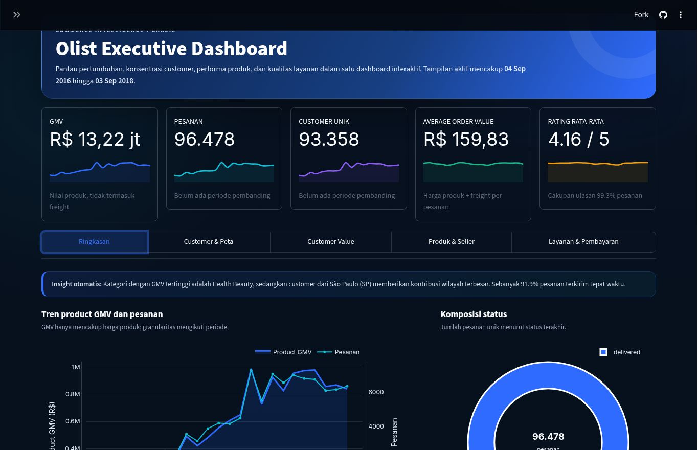
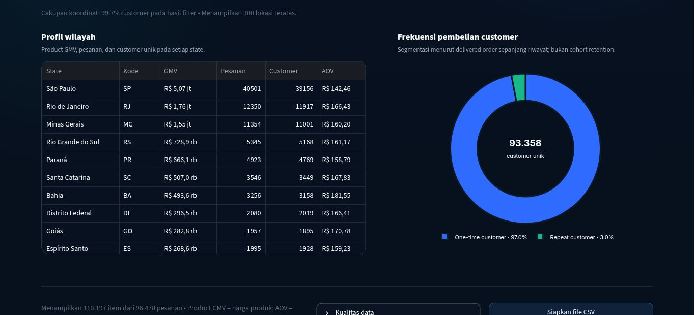
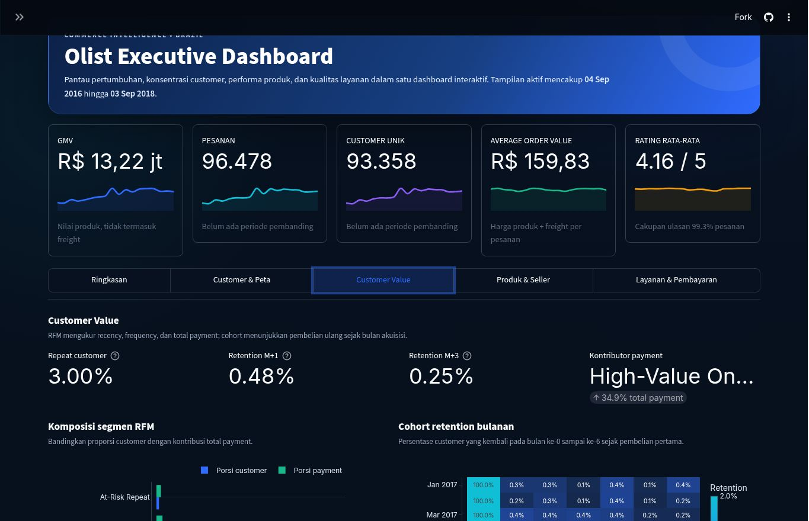
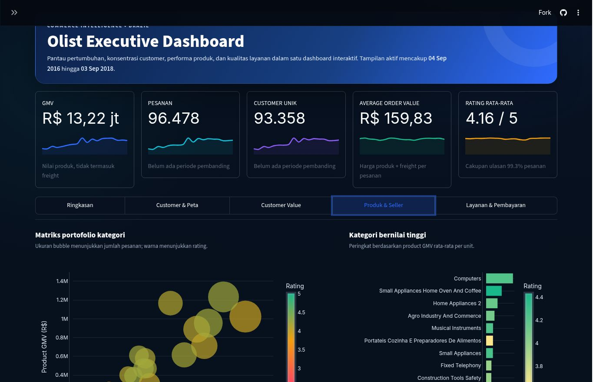
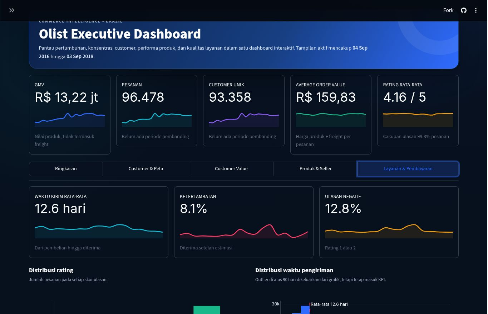
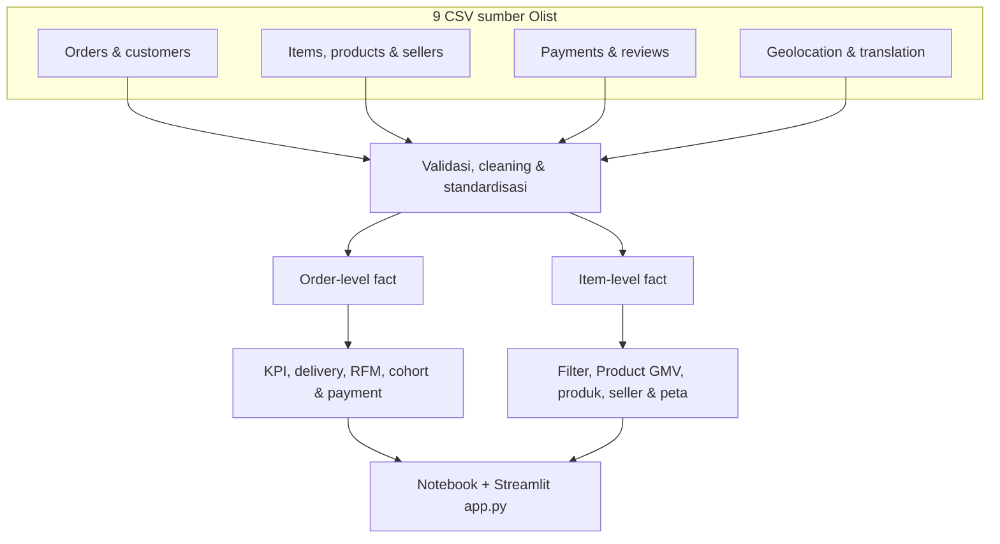

<div align="center">

# Olist E-Commerce Intelligence

[](https://www.python.org/)
[](https://streamlit.io/)
[](https://plotly.com/python/)
[](LICENSE)
[](docs/DATA_ATTRIBUTION.md)

Dashboard business intelligence interaktif untuk mengeksplorasi performa
e-commerce Olist di Brasil. Proyek ini mengubah sembilan CSV mentah menjadi
analisis yang dapat direproduksi pada level order dan item, lalu menyajikan
KPI, tren, geografi customer, performa produk dan seller, kualitas layanan,
RFM, serta cohort retention melalui Streamlit.

[**Buka dashboard live**](https://olist-ecommerce-intelligence-95.streamlit.app/)
· [**Lihat notebook**](notebooks/ecommerce_analysis.ipynb)
· [**Baca metodologi**](docs/METHODOLOGY.md)
· [**Lihat data dictionary**](docs/DATA_DICTIONARY.md)



</div>

## Daftar isi

- [Ikhtisar](#ikhtisar)
- [Temuan utama](#temuan-utama)
- [Tampilan dashboard](#tampilan-dashboard)
- [Fitur utama](#fitur-utama)
- [Definisi KPI](#definisi-kpi)
- [Arsitektur analitik](#arsitektur-analitik)
- [Dataset](#dataset)
- [Struktur repository](#struktur-repository)
- [Menjalankan proyek](#menjalankan-proyek)
- [Deployment](#deployment-streamlit-community-cloud)
- [Reproducibility](#reproducibility)
- [Quality gate](#quality-gate)
- [Keterbatasan](#keterbatasan)
- [Dokumentasi](#dokumentasi)
- [Lisensi dan atribusi](#lisensi-dan-atribusi)

## Ikhtisar

Proyek ini menggunakan
[Brazilian E-Commerce Public Dataset by Olist](https://www.kaggle.com/datasets/olistbr/brazilian-ecommerce),
yang mencakup transaksi anonim dari 2016–2018. Analisis dirancang untuk
menjawab enam pertanyaan bisnis:

1. Bagaimana skala, pertumbuhan, dan pola bulanan bisnis?
2. Kategori apa yang unggul dari sisi unit dan Product GMV?
3. Bagaimana performa seller tersebar secara geografis?
4. Wilayah customer mana yang paling besar dan bagaimana pola pembeliannya?
5. Seberapa sehat repeat purchase, RFM, dan cohort retention?
6. Bagaimana kualitas pengiriman, rating, dan komposisi pembayaran?

Dashboard menggunakan filter tanggal, state customer, kategori produk, status
order, dan state seller. Tampilan default memakai seluruh periode data dengan
status `delivered`.

## Temuan utama

### Baseline dashboard

| KPI | Nilai default |
|---|---:|
| Delivered orders | 96.478 |
| Unique customers | 93.358 |
| Item records | 110.197 |
| Product GMV | R$13.221.498,11 |
| Order value | R$15.419.773,75 |
| AOV | R$159,83 |
| Average rating | 4,1562 / 5 |
| Review coverage | 99,3% |
| Repeat-customer rate | 3,00% |
| Retention M+1 / M+3 | 0,48% / 0,25% |

### Insight bisnis

- Delivered orders Januari–Agustus 2018 tumbuh **139,9% YoY**, sementara
  Product GMV tumbuh **141,1% YoY**.
- `bed_bath_table` memimpin unit terjual, sedangkan `health_beauty` memimpin
  Product GMV. Ranking volume dan ranking nilai perlu digunakan untuk keputusan
  yang berbeda.
- **91,9%** order terkirim tepat waktu. Late orders memiliki low-rating rate
  **54,0%**, sekitar **5,9×** on-time orders, sehingga delivery exception
  merupakan prioritas operasional utama.
- São Paulo menyumbang sekitar **42,0% delivered orders** dan Product GMV
  sekitar **R$5,07 juta**. CE, BA, dan RJ menjadi prioritas audit layanan di
  antara state dengan minimal 1.000 order.
- Repeat-customer rate hanya **3,00%**. Retention M+1 **0,48%** dan M+3
  **0,25%** menunjukkan peluang besar pada second-purchase program.
- Segmen **High-Value One-Time** menyumbang **34,9% total payment**, menandakan
  nilai besar masih terkonsentrasi pada pembeli satu kali.
- Credit card menyumbang **78,5% payment value**, sedangkan 100 seller teratas
  menyumbang **45,5% Product GMV**.

Insight ini berasal dari notebook yang telah dieksekusi ulang dan baseline
dashboard dengan status `delivered`. Temuan bersifat deskriptif dan
observasional; rekomendasi perlu divalidasi melalui eksperimen atau pilot.

## Tampilan dashboard

Dashboard dibagi menjadi lima bagian dan hanya menghitung visual berat saat
bagian tersebut dibuka.

| Ringkasan | Customer & Peta |
|---|---|
| Tren Product GMV, order, status, kategori, dan state customer. | Profil wilayah dan frekuensi pembelian; peta Folium interaktif tersedia pada aplikasi live. |
|  |  |

| Customer Value | Produk & Seller |
|---|---|
| Repeat rate, RFM, dan cohort retention M+0–M+6. | Portofolio kategori, nilai per unit, produk terlaris, dan kekuatan seller. |
|  |  |

### Layanan & Pembayaran

Bagian ini memuat waktu kirim, keterlambatan, review negatif, distribusi
rating, distribusi waktu pengiriman, serta nilai dan porsi metode pembayaran.



## Fitur utama

| Area | Kemampuan |
|---|---|
| Filter | Rentang tanggal inklusif, state customer, kategori, status order, dan state seller |
| KPI | Product GMV, order, customer unik, AOV, rating, delivery, repeat, dan retention |
| Perbandingan | Delta terhadap periode kalender sebelumnya dengan panjang yang sama |
| Geospasial | Bubble/heatmap Folium, median koordinat per prefix kode pos, dan cakupan koordinat |
| Customer value | Segmentasi RFM, kontribusi payment, repeat rate, dan cohort M+0–M+6 |
| Produk & seller | Bubble portfolio, kategori bernilai tinggi, produk terlaris, dan seller per state |
| Kualitas layanan | On-time rate, delivery days, keterlambatan, rating, dan review negatif |
| Ekspor | CSV turunan berdasarkan filter aktif |
| Kualitas data | Deteksi file hilang/terpotong, validasi kolom, grain, key, dan jumlah baris |
| Performa | Cache data dan lazy rendering untuk bagian analisis yang berat |

## Definisi KPI

| KPI | Definisi |
|---|---|
| Product GMV | `Σ price` pada item yang masuk hasil filter; tidak mencakup freight |
| Orders | Jumlah unik `order_id` |
| Unique customers | Jumlah unik `customer_unique_id` |
| AOV | `Σ(price + freight_value) / jumlah order unik` |
| Average rating | Rata-rata `review_score` setelah review diagregasi per order |
| Review coverage | Order dengan rating dibagi seluruh order terpilih |
| On-time rate | Order delivered dengan tanggal aktual ≤ tanggal estimasi |
| Delivery days | Tanggal diterima customer dikurangi timestamp pembelian |
| Repeat-customer rate | Customer dengan ≥2 delivered orders dibagi seluruh customer delivered |
| Payment share | Nilai payment suatu metode dibagi total payment |

Definisi lengkap, semantik filter kategori/seller, serta aturan pencegahan
double counting tersedia di [METHODOLOGY.md](docs/METHODOLOGY.md).

## Arsitektur analitik



Pipeline menjaga grain analisis agar join item, payment, dan review tidak
menggandakan nilai. Review diagregasi per order, payment diproses pada grain
payment/order, sedangkan Product GMV dan freight tetap berasal dari grain item.

## Dataset

| File | Grain | Primary/analytical key |
|---|---|---|
| `customers_dataset.csv` | Satu customer record | `customer_id` |
| `geolocation_dataset.csv` | Satu observasi prefix kode pos | Prefix + koordinat |
| `order_items_dataset.csv` | Satu item dalam order | `order_id`, `order_item_id` |
| `order_payments_dataset.csv` | Satu payment record | `order_id`, `payment_sequential` |
| `order_reviews_dataset.csv` | Satu review record | `review_id`, `order_id` |
| `orders_dataset.csv` | Satu order | `order_id` |
| `product_category_name_translation.csv` | Satu terjemahan kategori | `product_category_name` |
| `products_dataset.csv` | Satu produk anonim | `product_id` |
| `sellers_dataset.csv` | Satu seller anonim | `seller_id` |

Jumlah baris, ukuran, checksum SHA-256, relasi, nullability, dan penjelasan
seluruh 52 kolom sumber tersedia pada
[DATA_ATTRIBUTION.md](docs/DATA_ATTRIBUTION.md) dan
[DATA_DICTIONARY.md](docs/DATA_DICTIONARY.md).

## Struktur repository

```text
.
├── app.py
├── data/
│   ├── customers_dataset.csv
│   ├── geolocation_dataset.csv
│   └── ... 7 CSV Olist lainnya
├── notebooks/
│   └── ecommerce_analysis.ipynb
├── docs/
│   ├── screenshots/
│   ├── DASHBOARD_CHANGELOG.md
│   ├── DATA_ATTRIBUTION.md
│   ├── DATA_DICTIONARY.md
│   ├── FINAL_AUDIT_REPORT.md
│   ├── METHODOLOGY.md
│   └── RELEASE_CHECKLIST.md
├── tests/
│   ├── test_data_metrics.py
│   ├── test_notebook.py
│   ├── test_repository_integrity.py
│   └── test_streamlit_app.py
├── .github/workflows/quality-gate.yml
├── .devcontainer/
├── .streamlit/
├── pytest.ini
├── requirements.txt
├── requirements-notebook.txt
├── requirements-dev.txt
└── LICENSE
```

## Menjalankan proyek

### Prasyarat

- Git dan [Git LFS](https://git-lfs.com/)
- Python 3.11
- Sekitar 1 GB ruang kosong untuk environment dan data

### 1. Clone dan ambil data LFS

```bash
git clone https://github.com/mpnabil95/olist-ecommerce-intelligence.git
cd olist-ecommerce-intelligence
git lfs install
git lfs pull
```

Pastikan `data/geolocation_dataset.csv` bukan pointer LFS sebelum menjalankan
aplikasi. File lengkap berukuran 61.273.883 byte atau sekitar 61,27 MB:

```bash
git lfs status
```

### 2. Buat virtual environment

#### Windows PowerShell

```powershell
py -3.11 -m venv .venv
.\.venv\Scripts\Activate.ps1
python -m pip install --upgrade pip
python -m pip install -r requirements.txt
```

#### macOS/Linux

```bash
python3.11 -m venv .venv
source .venv/bin/activate
python -m pip install --upgrade pip
python -m pip install -r requirements.txt
```

### 3. Jalankan dashboard

```bash
python -m streamlit run app.py
```

Streamlit akan membuka aplikasi pada `http://localhost:8501`.

### 4. Buka notebook

Gunakan dependency notebook:

```bash
python -m pip install -r requirements-notebook.txt
```

Kemudian buka `notebooks/ecommerce_analysis.ipynb` melalui VS Code atau
Jupyter-compatible editor dan pilih interpreter `.venv`. Notebook final
terdiri dari 74 cell dengan 19 code cell.

### Pilihan dependency

| File | Kegunaan |
|---|---|
| `requirements.txt` | Runtime dashboard |
| `requirements-notebook.txt` | Runtime dashboard + analisis notebook |
| `requirements-dev.txt` | Seluruh dependency + alat validasi |

## Deployment Streamlit Community Cloud

Konfigurasi deployment yang digunakan:

| Pengaturan | Nilai |
|---|---|
| Repository | `mpnabil95/olist-ecommerce-intelligence` |
| Main file | `app.py` |
| Python | 3.11 |
| Secrets | Tidak diperlukan |
| Dependency | `requirements.txt` |

Dashboard publik:
[olist-ecommerce-intelligence-95.streamlit.app](https://olist-ecommerce-intelligence-95.streamlit.app/)

Untuk deployment baru, pastikan sembilan CSV dapat diambil melalui Git LFS dan
working directory tetap berada pada root repository.

## Reproducibility

Project candidate telah diverifikasi pada environment bersih Python 3.11:

- `pip install -r requirements-dev.txt` berhasil;
- `pip check` tidak menemukan konflik;
- seluruh import utama dan kompilasi `app.py` berhasil;
- kelima bagian dashboard lulus smoke test;
- notebook berhasil dieksekusi ulang pada 19/19 code cell;
- row count dan checksum seluruh sembilan dataset cocok dengan inventaris.

Repository menyediakan regression test dan workflow CI untuk mengulang
pemeriksaan tersebut pada Python 3.11. Bukti audit dan item yang masih perlu
diverifikasi sebelum merge tersedia pada
[FINAL_AUDIT_REPORT.md](docs/FINAL_AUDIT_REPORT.md).

## Quality gate

Pasang dependency development sebelum menjalankan pemeriksaan lokal:

```bash
python -m pip install -r requirements-dev.txt
python -m pip check
```

Jalankan gerbang secara bertahap agar penggunaan memori dashboard dan notebook
tidak saling bertumpuk:

```bash
# Data, KPI, RFM/cohort, checksum, dokumentasi, dan hygiene
python -m pytest -m "not streamlit and not notebook"

# Kelima bagian Streamlit, default filter, empty-state, dan kontrol ekspor
python -m pytest -m streamlit

# Eksekusi bersih seluruh 19 code cell notebook
python -m pytest -m notebook
```

Dependency vulnerability scan menggunakan `pip-audit` secara terpisah agar
alat security tidak menjadi dependency aplikasi:

```bash
python -m pip install pip-audit==2.10.1
python -m pip_audit -r requirements-dev.txt
```

Workflow [Quality Gate](.github/workflows/quality-gate.yml) menjalankan
application tests, notebook execution, dan dependency audit pada push ke
`development/v2-finalization`/`main`, pull request ke `main`, atau pemicu
manual.

## Keterbatasan

- Data hanya mencakup snapshot transaksi Olist pada 2016–2018.
- Dataset anonim tidak menyediakan nama produk, profit, biaya pemasaran,
  customer acquisition cost, atau identitas customer.
- Product GMV bukan revenue bersih maupun profit dan tidak mencakup freight.
- Label produk memakai kategori dan potongan `product_id` karena nama produk
  tidak tersedia.
- Geolocation merepresentasikan median koordinat pada prefix kode pos, bukan
  alamat customer yang presisi.
- Repeat rate dan cohort retention dipengaruhi batas awal/akhir periode data
  serta tidak mengamati transaksi customer di luar Olist.
- Hubungan keterlambatan dan rating bersifat asosiasi, bukan bukti kausal.
- Filter kategori/seller memilih order melalui item; payment dan monetary RFM
  tetap menggunakan total payment dari order terpilih.

## Dokumentasi

- [Dashboard changelog](docs/DASHBOARD_CHANGELOG.md)
- [Data dictionary](docs/DATA_DICTIONARY.md)
- [Methodology](docs/METHODOLOGY.md)
- [Data attribution and license](docs/DATA_ATTRIBUTION.md)
- [Release checklist](docs/RELEASE_CHECKLIST.md)
- [Final audit report](docs/FINAL_AUDIT_REPORT.md)

## Lisensi dan atribusi

Kode, konfigurasi, dan dokumentasi asli proyek menggunakan
[MIT License](LICENSE) atas nama Muhammad Pangeran Nabil.

Dataset Olist tetap berada di bawah
[CC BY-NC-SA 4.0](https://creativecommons.org/licenses/by-nc-sa/4.0/).
Lisensi MIT pada root repository tidak melisensikan ulang CSV, tabel, grafik,
atau ekspor yang berasal dari data Olist. Penggunaan dataset harus
nonkomersial, mencantumkan atribusi, dan mengikuti ketentuan ShareAlike.

Sitasi yang disarankan:

```text
Olist. (2018). Brazilian E-Commerce Public Dataset by Olist [Data set].
Kaggle. https://www.kaggle.com/datasets/olistbr/brazilian-ecommerce
```

Proyek ini merupakan analisis independen untuk pendidikan dan portfolio serta
tidak berafiliasi dengan, disponsori oleh, atau didukung secara resmi oleh
Olist maupun Kaggle.
